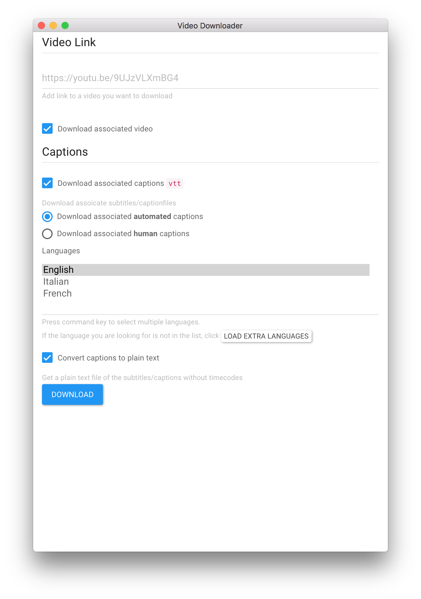
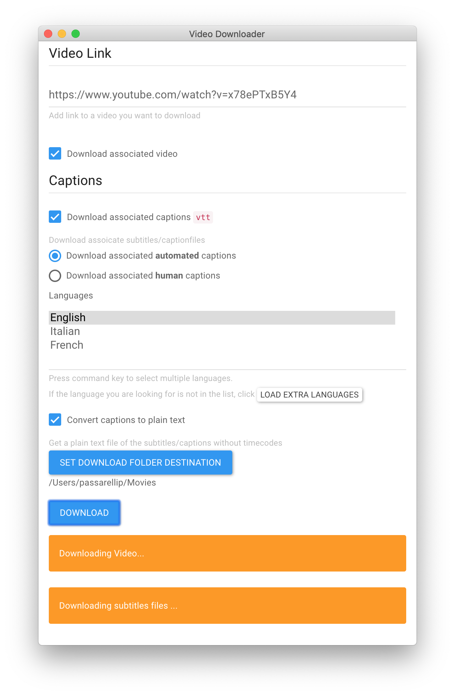

# Electron video (youtube) downloader 

An app that quickly downloads video from youtube, and corresponding human or automated captions. 

The app is built in electron for osx, and uses [youtube-dl](https://rg3.github.io/youtube-dl/) under the hood, which means there is [a long list of supported sites](youtube-dl-supported-extractors.md). 

## Key features

- Download video form youtube and other sites
- Download captions from youtube `vtt`
- Option to convert youtube capitons into plain text on download
- Option to download youtube automated captions
- Option to download "youtube human proofread captions" when available
- Option to load a comprensive list of languages for captions files 
- Works on osx desktop 

## Usage

- Download latest app from [release section](https://github.com/pietrop/electron-video-downloader/releases) 
	- if you get the `unidentified developererror` message, [follow these instructions](https://support.apple.com/kb/ph18657?locale=en_US).
- Add youtube url from youtube `share` functionality 
- chose app preferences, see screenshot below.
- click `Download`
- retrieve downloaed files in `Movie` folder 
- done :)






## Development 

`git clone` repo, cd into folder, `npm install`, `npm start`.


## Build

To package for OSX as `dmg`

```
npm run build:mac
```

OR to package for OSX as `zip` file

```

npm run pack:mac
```

See [`package.json`](./package.json) scripts section for details on packaging for other platforms.

```json
"pack": "build --dir",
"pack:mac": "build --dir --mac --x64",
"pack:linux": "build --dir --linux --x64",
"pack:win": "build --dir --win --x64",
"build": "build",
"build:mac": "build --mac --x64",
"build:mac_app_store": "echo 'Mac App Store Option Not currently implemented'",
"build:win": "build --win nsis-web --x64",
"build:linux": "build --linux  --x64"
```

## Possible todo to extend the app: 
- [x] add check box option for [downloading associated subtitles](https://github.com/przemyslawpluta/node-youtube-dl#downloading-subtitles). 
- [x] support languages other then english when downloading captions.  
- [ ] if url is of playlist, then [download playlist](https://github.com/przemyslawpluta/node-youtube-dl#downloading-playlists)
- [ ] show [list of extractors in app](https://github.com/przemyslawpluta/node-youtube-dl#getting-the-list-of-extractors) _half implemented, but vimeo not working_
- [ ] _optional_ a video preview for select url.  
- [ ] figure out a way to support direct url to video, eg not from supported extractors.  
- [x] Add CSS styling (needs checking if `youtube-dl` works cross platform).
- [x] Package app and make release.
- [x] Check if app works on osx, 
- [ ] Check if app works windows, 
- [ ] Check if app works linux. 
- [x] add a logo. 
- [ ] refactor yotube downloader as separate component.
- [ ] add possibility for user to set default destination folder, as opposed to `Movie` in home folder on osx.
- [ ] change `var destDownloadFolder  = app.getPath("videos");` to be a default, corresponds to `Movie` folder.
	- [ ] with a promt to change dest folder to prefered one, and rember choice, eg in local storage`?`


- [ ] Add `human` vs `automated` label to text file of captions to distinguish is downloading both one after the other.
- [ ] escape emoji, sometimes emojis are in the title, and that's hard to parse/read/save.

<!-- https://github.com/rg3/youtube-dl/blob/master/README.md#readme

https://github.com/rg3/youtube-dl/blob/master/README.md#video-format-options

https://github.com/rg3/youtube-dl/blob/master/README.md#format-selection -->


<!-- explore this option 
https://github.com/joegesualdo/get-youtube-subtitle-url-node
 -->

## Contributors 

- [Pietro](https://twitter.com/pietropassarell)
